# Project_Practice
 Project practice
--

# Mybatis概述

## 什么是MyBatis

MyBatis是一款优秀的**持久层框架**

MyBatis的前身叫iBatis，本是apache的一个开源项目, 2010年这个项目由apache software foundation 迁移到了google code，并且改名为MyBatis。

- MyBatis是支持普通SQL查询，存储过程和高级映射的优秀持久层框架。
- MyBatis消除了几乎所有的JDBC代码和参数的手工设置以及结果集的检索。
- MyBatis使用简单的XML或注解用于配置和原始映射，将接口和Java的POJOs（Plan Old Java Objects，普通的Java对象）映射成数据库中的记录。


MyBatis官网：

https://mybatis.net.cn/


## 与Jdbc相比

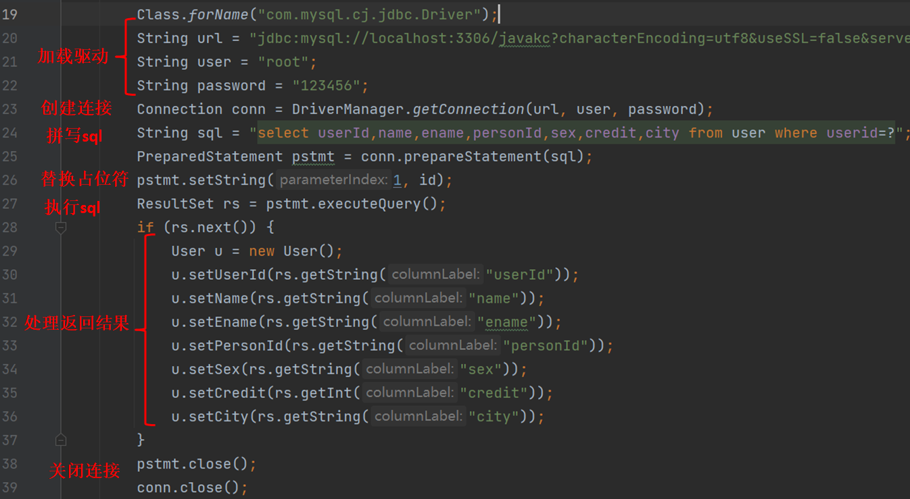


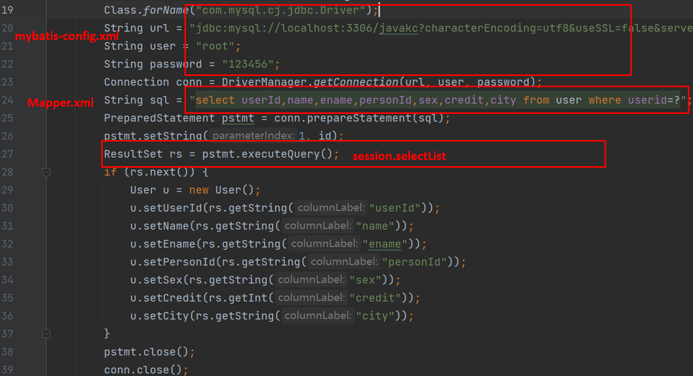


#  MyBatis入门

1. 创建表结构
2. 创建java工程，导入依赖
3. 定义POJO类
4. 编写映射文件
5. 编写核心配置文件
6. 编码
   1. 加载核心配置文件，获取SqlSessionFactory对象
   2. 获取SqlSession对象，执行SQL语句
   3. 释放资源

## 查询数据


### 创建表结构


### 创建java工程

在pom.xml文件中

导入mybatis依赖：

```xml
<dependency>
  <groupId>org.mybatis</groupId>
  <artifactId>mybatis</artifactId>
  <version>3.5.10</version>
</dependency>
```

导入mysql依赖：

```xml
<dependency>
    <groupId>mysql</groupId>
    <artifactId>mysql-connector-java</artifactId>
    <version>8.0.30</version>
</dependency>
```


### 定义POJO类

```JAVA
package com.javakc.demo1.pojo;
public class User {
    private String userId;
    private String name;
    private String ename;
    private String personId;
    private String sex;
    private int credit;
    private String city;
}
```


### 编写Mapper映射文件

UserMapper.xml

```XML
<?xml version="1.0" encoding="UTF-8" ?>
<!DOCTYPE mapper
        PUBLIC "-//mybatis.org//DTD Mapper 3.0//EN"
        "http://mybatis.org/dtd/mybatis-3-mapper.dtd">
<mapper namespace="user">
    <select id="queryAll" resultType="com.javakc.demo1.pojo.User">
        select * from user
    </select>
</mapper>
```


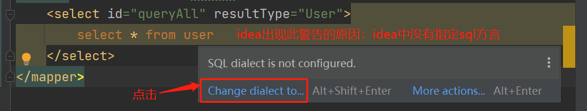


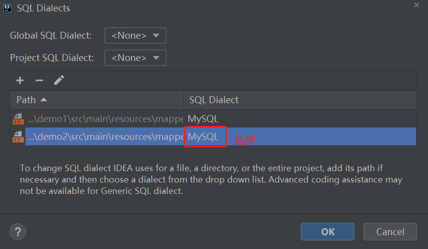


sql语句中特殊字符处理：

- 转义符 `&lt;`
- `<![CDATA[内容]]>`


### 编写核心配置文件

MyBatis 系统的核心设置，包括获取数据库连接实例的数据源（DataSource）以及决定事务作用域和控制方式的事务管理器（TransactionManager）

mybatis-config.xml

```xml
<?xml version="1.0" encoding="UTF-8" ?>
<!DOCTYPE configuration
        PUBLIC "-//mybatis.org//DTD Config 3.0//EN"
        "http://mybatis.org/dtd/mybatis-3-config.dtd">
<configuration>
    <!-- 引入配置的资源文件 -->
    <properties resource="db.properties"/>

    <!-- 对事务的管理和连接池的配置 -->
    <!-- development:开发模式 work : 工作模式 -->
    <environments default="development">
        <environment id="development">
            <transactionManager type="JDBC"/>
            <dataSource type="POOLED">
                <property name="driver" value="${jdbc.driver}"/>
                <property name="url" value="${jdbc.url}"/>
                <property name="username" value="${jdbc.username}"/>
                <property name="password" value="${jdbc.password}"/>
            </dataSource>
        </environment>
    </environments>
    <mappers>
        <mapper resource="mapper/UserMapper.xml"/>
    </mappers>
</configuration>
```


```properties
jdbc.driver=com.mysql.cj.jdbc.Driver
jdbc.url=jdbc:mysql://localhost:3306/javakc?characterEncoding=utf8&useSSL=false&serverTimezone=Asia/Shanghai&rewriteBatchedStatement=true
jdbc.username=root
jdbc.password=123456
```


### 单元测试

SqlSessionFactory是mybatis操作数据库的接口（执行CRUD等操作），它也可以执行事务管理等操作。这个类是我们使用mybatis的最主要的类。它是线程安全的。通常，将它定义为单例。


```java
package com.javakc.demo1.dao;

import com.javakc.demo1.pojo.User;
import org.apache.ibatis.io.Resources;
import org.apache.ibatis.session.SqlSession;
import org.apache.ibatis.session.SqlSessionFactory;
import org.apache.ibatis.session.SqlSessionFactoryBuilder;
import org.junit.Test;
import java.io.IOException;
import java.io.InputStream;
import java.util.List;
public class DaoImplTest {
    @Test
    public void testQueryAll(){
        SqlSessionFactory factory =null;
        try {
            //读取核心配置文件mybatis-config.xml
            InputStream inputStream = Resources.getResourceAsStream("mybatis-config.xml");
            //解析xml配置文件产生SqlSessionFactory对象
            factory = new SqlSessionFactoryBuilder().build(inputStream);
            //通过SqlSessionFactory来创建一个SqlSession
            SqlSession session = factory.openSession(true);
            //SqlSession 包含了所有执行数据库SQL 语句的方法
            List<User> list = session.selectList("user.queryAll");

            for (Object o : list) {
                System.out.println(o);
            }
            session.close();
        } catch (IOException e) {
            e.printStackTrace();
        }
    }
}

```


### 日志


```xml
<settings>
    <setting name="logImpl" value="STDOUT_LOGGING" />
</settings>
```

STDOUT_LOGGING是标准日志。mybatis自带的

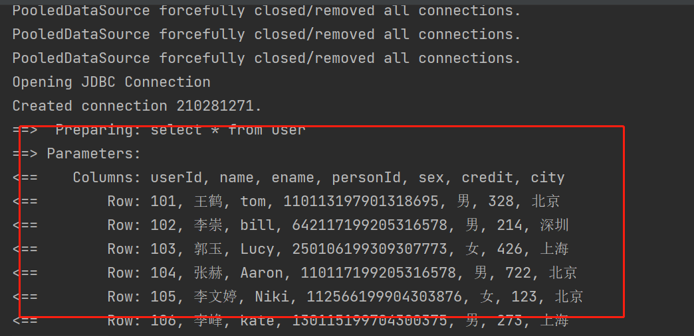


### 配置实体类别名

```xml
<!-- 配置实体类的别名 -->
<typeAliases>
    <typeAlias type="com.javakc.demo1.pojo.User" alias="User" />
</typeAliases>
```


## 插入数据

### 编写映射文件

```xml
<insert id="insert" parameterType="User">
    insert into user(userId, name, ename, personId, sex, credit, city)
    VALUES(#{userId},#{name},#{ename},#{personId}, #{sex}, #{credit}, #{city})
</insert>
```


### 单元测试

```java
User u=new User();
u.setUserId("202");
u.setName("杨幂");
u.setEname("Mini");
u.setPersonId("110201198609125331");
u.setSex("女");
u.setCredit(423);
u.setCity("北京");
int i=session.insert("user.insert",u);
```


### 参数占位符

- #{}翻译sql时，将#{}占位符替换为?占位符
  - 对于变量部分，应当使用#，这样可以有效的防止sql注入，# 都是用到了prepareStement，这样对效率也有一定的提升。
- ${}只是简单的字符拼接而已
  - 对于非变量部分，那只能使用\$，会存在SQL注入问题


### 事务

mybatis底层使用的是JDBC（mybatis.xml中配置的 transactionManager 标签的 type 设为 JDBC ）

mybatis会默认开启事务，也就是说，mybatis默认是关闭自动提交的。

在mybatis中，如果我们执行了数据库的修改操作（insert、update、delete），必须调用sqlSession.commit()方法，所做的修改才能持久化到磁盘。

在openSession()时，传入true，即开启自动提交，可关闭事务。（ openSession(true) ）

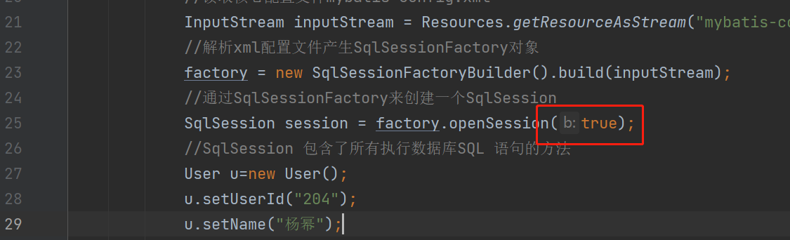


### 运行过程

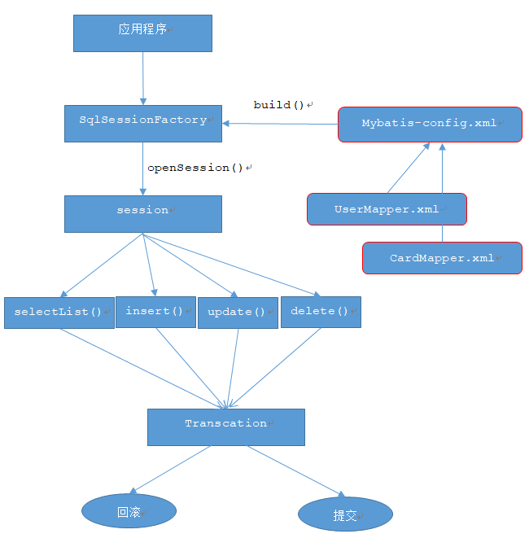


# Mapper代理开发


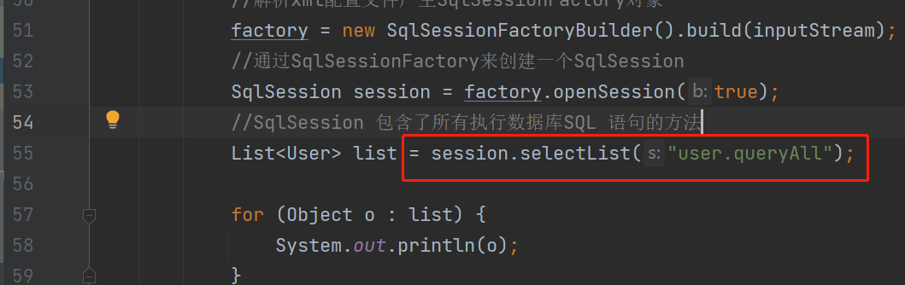

我们真正需要关心的只有红框这行代码。

基于这个原因，MyBatis为我们提供了 Mapper 代理开发方式，我们只需要编写 DAO 接口和配置 Mapper 映射文件即可，DAO实现类由 MyBatis 为我们生成。

## 原理简述

MyBatis的 Mapper 开发方式，从设计模式的角度看，使用了模板模式。从实现的角度看，它使用了 JDK 的动态代理，为我们生成 DAO 实现类。

## 查询数据

使用 Mapper 代理开发方式进行开发，步骤如下：

创建 Mapper 接口
编写 Mapper 映射文件
编写全局配置文件
单元测试

### 创建 Mapper 接口

```java
package com.javakc.demo2.mapper;

import com.javakc.demo2.pojo.User;

public interface UserMapper {
    public User load(String userId);
}
```


### 编写 Mapper 映射文件

```xml
<?xml version="1.0" encoding="UTF-8" ?>
<!DOCTYPE mapper
        PUBLIC "-//mybatis.org//DTD Mapper 3.0//EN"
        "http://mybatis.org/dtd/mybatis-3-mapper.dtd">
<mapper namespace="com.javakc.demo2.mapper.UserMapper">
    <select id="load" resultType="User" parameterType="String">
        select * from user where userId=#{userId}
    </select>
</mapper>
```

- namespace=Mapper接口的全路径

- Mapper接口与Mapper映射文件同名

- Mapper接口与Mapper映射文件在同一目录下

  


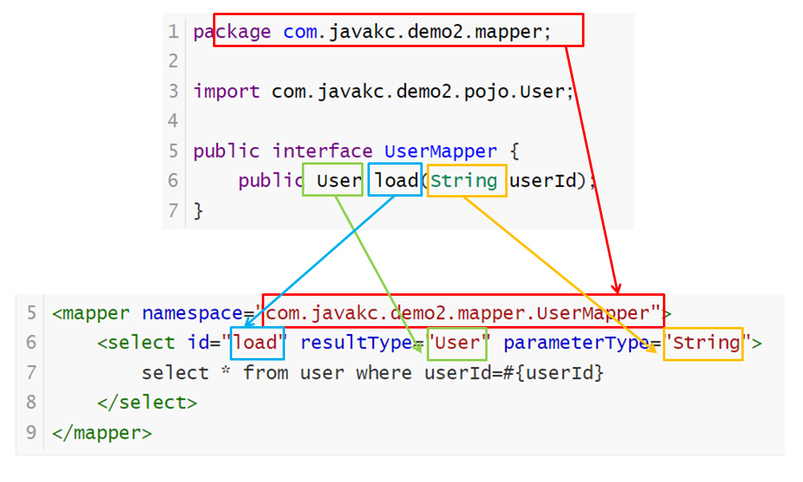

### 编写全局配置文件


```xml
<?xml version="1.0" encoding="UTF-8" ?>
<!DOCTYPE configuration
        PUBLIC "-//mybatis.org//DTD Config 3.0//EN"
        "http://mybatis.org/dtd/mybatis-3-config.dtd">
<configuration>
    <!-- 引入配置的资源文件 -->
    <properties resource="db.properties"/>

    <settings>
        <setting name="logImpl" value="STDOUT_LOGGING" />
    </settings>

    <!-- 配置实体类的别名 -->
    <typeAliases>
        <typeAlias type="com.javakc.demo2.pojo.User" alias="User" />
    </typeAliases>

    <environments default="development">
        <environment id="development">
            <transactionManager type="JDBC"/>
            <dataSource type="POOLED">
                <property name="driver" value="${jdbc.driver}"/>
                <property name="url" value="${jdbc.url}"/>
                <property name="username" value="${jdbc.username}"/>
                <property name="password" value="${jdbc.password}"/>
            </dataSource>
        </environment>
    </environments>
    <mappers>
        <mapper resource="com/javakc/demo2/mapper/UserMapper.xml"/>
    </mappers>
</configuration>
```


### 单元测试

```java
package com.javakc.demo2.mapper;

import com.javakc.demo2.pojo.User;
import org.apache.ibatis.io.Resources;
import org.apache.ibatis.session.SqlSession;
import org.apache.ibatis.session.SqlSessionFactory;
import org.apache.ibatis.session.SqlSessionFactoryBuilder;
import org.junit.Test;

import java.io.IOException;
import java.io.InputStream;

public class UserMapperTest {

    @Test
    public void testQueryAll(){
        SqlSessionFactory factory =null;
        try {
            //读取核心配置文件mybatis-config.xml
            InputStream inputStream = Resources.getResourceAsStream("mybatis-config.xml");
            //解析xml配置文件产生SqlSessionFactory对象
            factory = new SqlSessionFactoryBuilder().build(inputStream);
            //通过SqlSessionFactory来创建一个SqlSession
            SqlSession session = factory.openSession(true);
            //SqlSession 包含了所有执行数据库SQL 语句的方法
            UserMapper mapper=session.getMapper(UserMapper.class);
            User u= mapper.load("101");
            System.out.println(u);
            session.close();
        } catch (IOException e) {
            e.printStackTrace();
        }
    }
}


```


### 包扫描

```xml
<mappers>
    <package name="com.javakc.demo2.mapper"/>
</mappers>
```


加入包扫描后，再加入一个依赖

```xml
<dependency>
    <groupId>org.jboss</groupId>
    <artifactId>jboss-vfs</artifactId>
    <version>3.2.15.Final</version>
</dependency>
```


 


 

# Mybatis动态SQL

Mybatis 的强大特性之一便是它的动态 SQL。通过使用 JDBC 或其他类似框架的经验，你就能体会到根据不同条件拼接 SQL 语句有多么痛苦。拼接的时候要确保不能忘了必要的空格，还要注意省掉列名列表最后的逗号。利用动态 SQL 这一特性可以彻底摆脱这种痛苦。

Mybatis的动态SQL主要分为下列几类：

	if 		用于条件判断
	choose	相当于java 语言中的 switch
	trim 		对于包含的内容添加 前缀，后缀
	where 	简化sql语句中where条件判断的，能智能的处理 and or
	set 		用于更新时
	foreach 	用于循环迭代

## if判断条件

单条件判断  and表示且， or表示或

```xml
<mapper namespace="student">
	
	<select id="select">
		select * from user
		<if test="null != name and '' != name">
			where name = #{name}
		</if>
	</select>	
    
</mapper>

```


## choose多重判断

多条件判断等同于java中if-elseif-else

```xml
<select id="select">
		select * from 
		<choose>
			<when test="条件1">
				表1
			</when>
			<when test="条件2">
				表2
			</when>
			<otherwise>
				表3
			</otherwise>
		</choose>
	</select>

```


## trim前后缀处理


prefix：前缀增加其内容
suffix：后缀增加其内容
prefixOverrides：前缀覆盖判断的条件
suffixOverrides：后缀覆盖判断的条件


```xml
<select id="select">
	select * from user
	<trim prefix="where" prefixOverrides="and|or">
		<if test="null != name and '' != name">
			and name = #{name}
		</if>
		<if test="null != city and '' != city">
			and city = #{city}
		</if>

	</trim>
</select>

```


 

```xml
<update id="update">
	update user
		<trim prefix="set" suffix=" where id = #{id} " suffixOverrides=",">
			<if test="null != name and '' != name">
				name = #{name},
			</if>
			<if test="null != city and '' != city">
				city = #{city},
			</if>
			<if test="null != sex and '' != sex">
				sex = #{sex},
			</if>
		</trim>	
</update>

```


## where条件处理

where 标签主要用来简化 SQL 语句中的条件判断，可以自动处理 AND/OR 条件，语法如下：

```xml
<where>    
    <if test="判断条件">        
    	AND/OR ...    
    </if>
</where>
```

if 语句中判断条件为 true 时，where 关键字才会加入到组装的 SQL 里面，否则就不加入。where 会检索语句，它会将 where 后的第一个 SQL 条件语句的 AND 或者 OR 关键词去掉。

示例：

```xml
<select id="query" resultType="User">
    select * from user
    <where>
        <if test="name != null">
            AND name like #{name}
        </if>

        <if test="city!= null">
            AND city like #{city}
        </if>
    </where>
</select>
```


## set修改设置值

update 语句可以使用 set 标签动态更新列。

set 标签可以为 SQL 语句动态的添加 set 关键字，剔除追加到条件末尾多余的逗号。

```XML
<update id="update">
    UPDATE user
    <set>
        <if test="name!=null">name=#{name}</if>
        <if test="city!=null">city=#{city}</if>
    </set>
    WHERE userId=#{userId}
</update>
```


## foreach循环

| foreach循环 |                                              |
| ----------- | -------------------------------------------- |
| collection  | 执行迭代的元素，  可以是list, map, array等。 |
| open        | foreach循环开始添加的符号  例如：open=”(”    |
| close       | foreach循环结束添加的符号  例如：close=”)”   |
| item        | 每次迭代对象的别名                           |
| index       | list，array是元素下标，  map中是key          |
| separator   | 元素间的分隔符                               |

 

批量删除数据

```XML
<delete id="delete">
	delete from mybatis_student where id in 
	<foreach collection="array" open="(" close=")" item="id" separator=",">
		#{id}
	</foreach>
</delete>
```


## bind标签

 bind 标签可以通过 OGNL 表达式自定义一个上下文变量。

```xml
<select id="query" resultType="User">
    <bind name="name2" value="'%'+name+'%'"/>
    select * from user where name like #{name2}
</select>
```


# resultMap元素

resultMap 是 MyBatis 中最复杂的元素，主要用于解决实体类属性名与数据库表中字段名不一致的情况，可以将查询结果映射成实体对象。

> 现有的 MyBatis 版本只支持 resultMap 查询，不支持更新或者保存，更不必说级联的更新、删除和修改。

## resultMap元素的构成

resultMap 元素还可以包含以下子元素，代码如下。

```xml
<resultMap id="" type="">    
    <constructor><!-- 类在实例化时用来注入结果到构造方法 -->        
        <idArg/><!-- ID参数，结果为ID -->        
        <arg/><!-- 注入到构造方法的一个普通结果 -->     
    </constructor>    
    <id/><!-- 用于表示哪个列是主键 -->    
    <result/><!-- 注入到字段或JavaBean属性的普通结果 -->    
    <association property=""/><!-- 用于一对一关联 -->    
    <collection property=""/><!-- 用于一对多、多对多关联 -->    
    <discriminator javaType=""><!-- 使用结果值来决定使用哪个结果映射 -->        
        <case value=""/><!-- 基于某些值的结果映射 -->    
    </discriminator>
</resultMap>
```

其中：

- <resultMap> 元素的 type 属性表示需要的 POJO，id 属性是 resultMap 的唯一标识。
- 子元素 <constructor> 用于配置构造方法。当一个 POJO 没有无参数构造方法时使用。
- 子元素 <id> 用于表示哪个列是主键。允许多个主键，多个主键称为联合主键。
- 子元素 <result> 用于表示 POJO 和 SQL 列名的映射关系。
- 子元素 <association>、<collection> 和 <discriminator> 用在级联的情况下。


id 和 result 元素都有以下属性。


| 元素        | 说明                                                         |
| ----------- | ------------------------------------------------------------ |
| property    | 映射到列结果的字段或属性。如果 POJO 的属性和 SQL 列名（column元素）是相同的，那么 MyBatis 就会映射到 POJO 上 |
| column      | 对应 SQL 列                                                  |
| javaType    | 配置 Java 类型。可以是特定的类完全限定名或 MyBatis 上下文的别名 |
| jdbcType    | 配置数据库类型。这是 JDBC 类型，MyBatis 已经为我们做了限定，基本支持所有常用数据库类型 |
| typeHandler | 类型处理器。允许你用特定的处理器来覆盖 MyBatis 默认的处理器。需要指定 jdbcType 和 javaType 相互转化的规则 |


## 接受结果集

一条 SQL 查询语句执行后会返回结果集，结果集有两种存储方式，即使用 Map 存储和使用 POJO 存储。


## 一对一关联查询

通过 <resultMap> 元素的子元素 <association> 处理一对一级联关系

语法：

```XML
<resultMap type="类名" id="resultMapId">
    <id property="属性" column="主键" />
    <result property="属性" column="字段" />
    <!-- 一对一级联查询 -->
    <association property="属性" javaType="关联的类名">
        <id property="关联类的属性" column="关联表的主键" />
        <result property="关联类的属性" column="关联表的字段" />
        <result property="关联类的属性" column="关联表的字段" />
        <result property="关联类的属性" column="关联表的字段" />
    </association>
</resultMap>
<select id="statementId"  resultMap="resultMapId">
    两个表的关联查询sql
</select>
```


## 一对多关联查询

通过 <resultMap> 元素的子元素 <collection> 处理一对多级联关系，collection 可以将关联查询的多条记录映射到一个 list 集合属性中

语法：

```xml
<resultMap type="类名" id="resultMapId">
    <id property="属性" column="主键" />
    <result property="属性" column="主键" />
    <result property="属性" column="主键" />
    <!-- 一对多级联查询，ofType表示集合中的元素类型 -->
    <collection property="属性" ofType="关联的类名">
        <id property="关联类的属性" column="关联表的字段" />
        <result property="关联类的属性" column="关联表的字段" />
    </collection>
</resultMap>

<select id="statementId" resultMap="resultMapId">
    两个表的关联查询sql
</select>
```


# 缓存


## 什么是缓存

缓存是一个高速数据存储层，其中存储了数据子集，且通常是短暂性存储，这样日后再次请求该数据时，速度要比访问数据的主存储位置快。

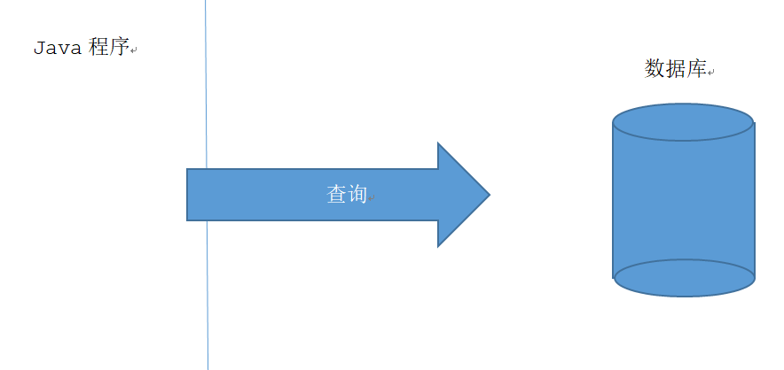


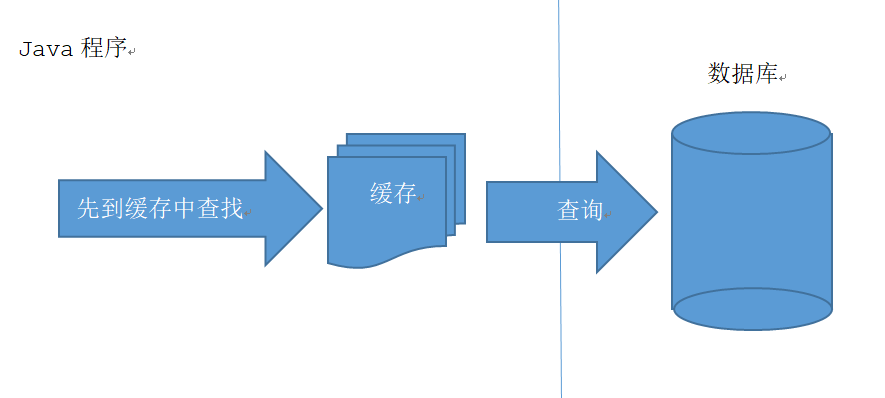

## 一级缓存

一级缓存：sqlSession级别的

Mybatis默认开启，

session.commit()或close()：一级缓存清空

 

##  二级缓存

二级缓存：sqlSessionFactory级别的


- MyBatis 的全局缓存配置需要在 mybatis-config.xml 的 settings 元素中设置，代码如下

```xml
<settings>
    <setting name="cacheEnabled" value="true" />
</settings>
```


- 在Mapper中配置<cache>,开启二级缓存
  - 默认不开启缓存。
  - 二级缓存的作用域是针对 mapper 的 namescape 而言，即只有再次在 namescape 内的查询才能共享这个缓存

```xml
<mapper namescape="">
    <!-- cache配置 -->
    <cache
        eviction="FIFO"
        flushInterval="60000"
        size="512"
        readOnly="true" />
    ...
</mapper>
```


| 属性          | 说明                                                         |
| ------------- | ------------------------------------------------------------ |
| eviction      | 代表的是缓存回收策略，目前 MyBatis 提供以下策略:<br />LRU：使用较少，移除最长时间不用的对象；<br />FIFO：先进先出，按对象进入缓存的顺序来移除它们；<br />SOFT：软引用，移除基于垃圾回收器状态和软引用规则的对象；<br />WEAK：弱引用，更积极地移除基于垃圾收集器状态和弱引用规则的对象。 |
| flushInterval | 刷新间隔时间，单位为毫秒，这里配置的是 100 秒刷新，如果省略该配置，那么只有当 SQL 被执行的时候才会刷新缓存。 |
| size          | 引用数目，正整数，代表缓存最多可以存储多少个对象，不宜设置过大。设置过大会导致内存溢出。这里配置的是 1024 个对象。 |
| readOnly      | 只读，默认值为 false，意味着缓存数据只能读取而不能修改，这样设置的好处是可以快速读取缓存，缺点是没有办法修改缓存。 |


对于 MyBatis 缓存仅作了解即可，因为面对一定规模的数据量，内置的 Cache 方式就派不上用场了，并且对查询结果集做缓存并不是 MyBatis 所擅长的，它专心做的应该是 SQL 映射。对于缓存，采用 OSCache、Memcached 等专门的缓存服务器来做更为合理。


#  MyBatis核心配置文件


```xml
<?xml version="1.0" encoding="UTF-8"?>
<!DOCTYPE configuration PUBLIC "-//mybatis.org//DTD Config 3.0//EN" "http://mybatis.org/dtd/mybatis-3-config.dtd">
<configuration>
    <!-- 引入配置的资源文件 -->
    <properties resource="db.properties" />

    <!-- 配置mybatis的运行方式 -->
    <settings>
        <!-- 全局映射器启用缓存 -->
        <setting name="cacheEnabled" value="true" />
        <!-- 查询时，关闭关联对象即时加载以提高性能 -->
        <setting name="lazyLoadingEnabled" value="true" />
        <!-- 设置关联对象加载的形态，此处为按需加载字段(加载字段由SQL指定)，不会加载关联表的所有字段，以提高性能 -->
        <setting name="aggressiveLazyLoading" value="false" />
        <!-- 对于未知的SQL查询，允许返回不同的结果集以达到通用的效果 -->
        <setting name="multipleResultSetsEnabled" value="true" />
        <!-- 允许使用列标签代替列名 -->
        <setting name="useColumnLabel" value="true" />
        <!-- 允许使用自定义的主键值(比如由程序生成的UUID 32位编码作为键值)，数据表的PK生成策略将被覆盖 -->
        <setting name="useGeneratedKeys" value="true" />
        <!-- 给予被嵌套的resultMap以字段-属性的映射支持 -->
        <setting name="autoMappingBehavior" value="FULL" />
        <!-- 对于批量更新操作缓存SQL以提高性能 SIMPLE BATCH -->
        <setting name="defaultExecutorType" value="SIMPLE" />
        <!-- 数据库超过25000毫秒仍未响应则超时 -->
        <setting name="defaultStatementTimeout" value="25000" />
        <!-- 配置使用log4j记录日志 -->
        <setting name="logImpl" value="STDOUT_LOGGING" />
    </settings>

    <!-- 配置实体类的别名 -->
    <typeAliases>
        <typeAlias type="com.javakc.demo2.pojo.User" alias="User" />
    </typeAliases>


    <!-- 对事务的管理和连接池的配置 -->
    <!-- development:开发模式 work : 工作模式 -->
    <environments default="development">
        <environment id="development">
            <transactionManager type="JDBC" />
            <dataSource type="POOLED">
                <property name="driver" value="${jdbc.driver}"/>
                <property name="url" value="${jdbc.url}"/>
                <property name="username" value="${jdbc.username}"/>
                <property name="password" value="${jdbc.password}"/>
            </dataSource>
        </environment>
    </environments>

    <!-- mapping文件路径配置 -->
    <mappers>
        <mapper resource="com/javakc/demo2/mapper/UserMapper.xml"/>
        <package name="com.javakc.demo2.mapper"/>
    </mappers>
</configuration>

```


 


 


 

 

 