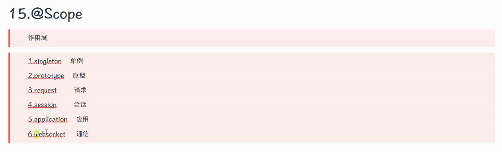

# 测试

> 新建Maven项目


> 成员方法
> 
> ---
> 
> ```java
> @Qualiflier
> 
> ```


> 关于接口的所有的实现类
> 
> 
> 
> <br/>


## 懒汉模式


> SpringIoC容器会在启动的时候实例化所有单实例 bean 。如果我们想要实现 Spring 在启动的时候延迟加载 bean，即在首次调用bean的时候再去执行初始化，就可以使用 @Lazy 注解来解决这个问题。
> 
> **注意**：`使用@Lazy的前提是要操作的Bean要使用默认的单例模式。`
> 
> 使用`@Lazy`懒加载注解可以减少springIOC容器启动过程的加载时间。
> 
> ```java
> package com.spring.config;
> import com.spring.bean.Person;
> import org.springframework.context.annotation.Bean;
> import org.springframework.context.annotation.Configuration;
> import org.springframework.context.annotation.Lazy;
> import org.springframework.context.annotation.Scope;
> import org.springframework.stereotype.Component;
> @Configuration
> //@Lazy注解作用于类上时，通常与@Component及其衍生Spring注解配合使用。
> /*@Component@Lazy*/
> public class TestLazyConfig {
>   // @Lazy注解属性 Value 取值为 true、false 。默认为true 表示启用懒加载。 
>   //false 表示不启用，基本用不到，如果不启用的话，不需要加@Lazy注解
>   // @Lazy注解作用于在类方法上时，通常与@Bean注解配合使用。    
>   @Lazy    
>   @Bean    
>   public Person person() {  
>   
>     System.out.println("测试容器添加Person对象");        
>     return new Person("小孙", 28, "西安");    
>     
>   }
>   
> }
> ```
> 
> ---
> 
> 初始化方式一：`@PostConstruct`注解
> 
> `@PostConstrust` 初始化 注解
> 
> 构造方法
> 
> > 假设类==**UserController**==有个成员变量==**UserService**==被`@Autowired`修饰，那么==**UserService**==的注入是在==**UserController**==的构造方法之后执行的。
> > 
> > 如果想在UserController对象生成时候完成某些初始化操作，而偏偏这些赖于依赖注入的对象，那么就无法在构造函数中实现（ps：spring启动时初始化异常），例如：
> 
> ```java
> public class UserController {
>     @Autowired
>     private UserService userService;
>  
>     public UserController() {
>         // 调用userService的自定义初始化方法，此时userService为null，报错
>         userService.userServiceInit();
>     }
> }
> ```

-  因此，可以使用`@PostConstruct`注解来完成初始化，`@PostConstruct`注解的方法将会在==**UserService**==注入完成后被自动调用。
- ```java
  public class UserController {
      @Autowired
      private UserService userService;
   
      public UserController() {
      }
   
      // 初始化方法
      @PostConstruct
      public void init(){
          userService.userServiceInit();
      }
  }
  ```

@Autowired详解

> 首先了解一下IOC操作Bean管理，bean管理是指
> 
> （1）spring创建对象 
> 
> （2）spring注入属性。
> 
> 当我们在将一个类上标注`@Service`或者`@Controller`或`@Component`或`@Repository`注解之后，spring的组件扫描就会自动发现它，并且会将其初始化为spring应用上下文中的bean。 当需要使用这个bean的时候，例如加上`@Autowired`注解的时候，这个bean就会被创建。而且初始化是根据**无参构造函数**。先看代码来体会一下这个注解的作用，测试代码如下：
> 
> (`@Data`注解是由Lombok库提供的，会生成getter、setter以及equals()、hashCode()、toString()等方法）

```java
@Data
@Service
public class AutoWiredBean {
    private int id;
    private String name;

    public AutoWiredBean(){
        System.out.println("无参构造函数");
    }

    public AutoWiredBean(int id, String name) {
        this.id = id;
        this.name = name;
        System.out.println("有参构造函数");
    }
}

```

`在springboot项目的测试类中进行测试，代码如下`

```java
@SpringBootTest
@RunWith(SpringRunner.class)
class Springboot02WebApplicationTests {


    private AutoWiredBean autoWiredBean;

    @Autowired
    public Springboot02WebApplicationTests (AutoWiredBean autoWiredBean){
        this.autoWiredBean = autoWiredBean;
    }

    @Test
    void contextLoads() {
    	System.out.println(autoWiredBean);
        System.out.println(autoWiredBean.getId());  //0
        System.out.println(autoWiredBean.getName());    //null
       
    }

}

```

---

> 总结：类初始化调用顺序：

1. ==**构造方法Constructor**==
2. ==**@Autowired**==
3. ==**@PostConstruct**==
   
   ---
   
   <br/>

<br/>

- 
- 
- 
- ioc不保存`原型实例`
- 
